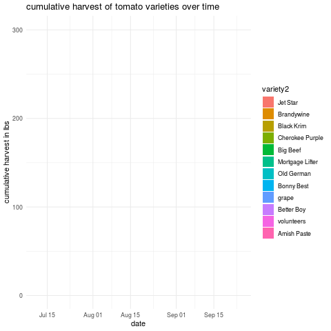

```{r setup, include=FALSE}
knitr::opts_chunk$set(echo = TRUE, error=TRUE, message=FALSE, warning=FALSE)
```

```{r libraries}
library(tidyverse)     # for data cleaning and plotting
library(googlesheets4) # for reading googlesheet data
library(lubridate)     # for date manipulation
library(openintro)     # for the abbr2state() function
library(palmerpenguins)# for Palmer penguin data
library(maps)          # for map data
library(ggmap)         # for mapping points on maps
library(gplots)        # for col2hex() function
library(RColorBrewer)  # for color palettes
library(sf)            # for working with spatial data
library(leaflet)       # for highly customizable mapping
library(ggthemes)      # for more themes (including theme_map())
library(plotly)        # for the ggplotly() - basic interactivity
library(gganimate)     # for adding animation layers to ggplots
library(transformr)    # for "tweening" (gganimate)
library(gifski)        # for creating the gif (don't need to load this library every time,but need it installed)
library(shiny)         # for creating interactive apps
library(ggimage)
gs4_deauth()           # To not have to authorize each time you knit.
theme_set(theme_minimal())
```

```{r data}
# SNCF Train data
small_trains <- read_csv("https://raw.githubusercontent.com/rfordatascience/tidytuesday/master/data/2019/2019-02-26/small_trains.csv") 

# Lisa's garden data
garden_harvest <- read_sheet("https://docs.google.com/spreadsheets/d/1DekSazCzKqPS2jnGhKue7tLxRU3GVL1oxi-4bEM5IWw/edit?usp=sharing") %>% 
  mutate(date = ymd(date))

# Lisa's Mallorca cycling data
mallorca_bike_day7 <- read_csv("https://www.dropbox.com/s/zc6jan4ltmjtvy0/mallorca_bike_day7.csv?dl=1") %>% 
  select(1:4, speed)

# Heather Lendway's Ironman 70.3 Pan Am championships Panama data
panama_swim <- read_csv("https://raw.githubusercontent.com/llendway/gps-data/master/data/panama_swim_20160131.csv")

panama_bike <- read_csv("https://raw.githubusercontent.com/llendway/gps-data/master/data/panama_bike_20160131.csv")

panama_run <- read_csv("https://raw.githubusercontent.com/llendway/gps-data/master/data/panama_run_20160131.csv")

#COVID-19 data from the New York Times
covid19 <- read_csv("https://raw.githubusercontent.com/nytimes/covid-19-data/master/us-states.csv")

```

## Put your homework on GitHub!

Go [here](https://github.com/llendway/github_for_collaboration/blob/master/github_for_collaboration.md) or to previous homework to remind yourself how to get set up. 

Once your repository is created, you should always open your **project** rather than just opening an .Rmd file. You can do that by either clicking on the .Rproj file in your repository folder on your computer. Or, by going to the upper right hand corner in R Studio and clicking the arrow next to where it says Project: (None). You should see your project come up in that list if you've used it recently. You could also go to File --> Open Project and navigate to your .Rproj file. 

## Instructions

* Put your name at the top of the document. 

* **For ALL graphs, you should include appropriate labels.** 

* Feel free to change the default theme, which I currently have set to `theme_minimal()`. 

* Use good coding practice. Read the short sections on good code with [pipes](https://style.tidyverse.org/pipes.html) and [ggplot2](https://style.tidyverse.org/ggplot2.html). **This is part of your grade!**

* **NEW!!** With animated graphs, add `eval=FALSE` to the code chunk that creates the animation and saves it using `anim_save()`. Add another code chunk to reread the gif back into the file. See the [tutorial](https://animation-and-interactivity-in-r.netlify.app/) for help. 

* When you are finished with ALL the exercises, uncomment the options at the top so your document looks nicer. Don't do it before then, or else you might miss some important warnings and messages.

## Warm-up exercises from tutorial

  1. Choose 2 graphs you have created for ANY assignment in this class and add interactivity using the `ggplotly()` function.
```{r}
lettuce_harvest<-garden_harvest%>%
  mutate(harvest=1)%>%
  filter(vegetable =="lettuce")%>%
  group_by(variety)%>%
  summarize(total_count=sum(harvest))%>%
  arrange(desc(total_count))%>%
  ggplot(aes(x=total_count,
             y=fct_reorder(variety,total_count)))+
  geom_bar(stat="identity")+
  labs(x="count",
       y="lettuce variety",
       title="Number of times I harvest for lettuce" )+
  theme(plot.title = element_text(hjust = 0.5))

ggplotly(lettuce_harvest,tooltip=c("text","x"))
```
```{r}
cumulative_cases<-covid19%>%
  filter(state %in% c("Minnesota","Wisconsin","Iowa","North Dakota","South Dakota"))%>%
  group_by(state,date)%>%
  summarize(tot_cases=cumsum(cases))%>%
  ggplot(aes(x=date,y=tot_cases,color=state))+
  geom_line()+
  labs(x="date",y="total cases",
       title="Cumulative cases by date and state")+
  theme(plot.title = element_text(hjust = 0.5))

ggplotly(cumulative_cases,tooltip=c("text","x","y"))
```

  2. Use animation to tell an interesting story with the `small_trains` dataset that contains data from the SNCF (National Society of French Railways). These are Tidy Tuesday data! Read more about it [here](https://github.com/rfordatascience/tidytuesday/tree/master/data/2019/2019-02-26).
**Railways tends to delay the longest around 23 weeks after the 2015 but it seems to be pretty on time for most of the time as the delay time is acceptable.**

```{r,eval=FALSE}
small_trains <- readr::read_csv("https://raw.githubusercontent.com/rfordatascience/tidytuesday/master/data/2019/2019-02-26/small_trains.csv") 

Month_longest_depart <- small_trains %>% 
  mutate(month_number = month + (year-2015)*12) %>% 
  group_by(month_number, departure_station) %>% 
  summarise(avg = mean(avg_delay_all_departing)) %>% 
  arrange(desc(avg))

ggplot(Month_longest_depart, aes(month_number, avg, group = departure_station)) + 
  geom_line() + 
  geom_segment(aes(xend = 31, yend = month_number), linetype = 2, colour = 'grey') + 
  geom_point(size = 2) + 
  geom_text(aes(x = 31.1, label = month_number), hjust = 0) + 
  transition_reveal(month_number) + 
  coord_cartesian(clip = 'off') + 
  labs(title = 'Month number', y = 'average delay time') + 
  theme_minimal() + 
  theme(plot.margin = margin(5.5, 40, 5.5, 5.5))
```
```{r}
anim_save("small_trains.gif")
```

```{r}

```

## Garden data

  3. In this exercise, you will create a stacked area plot that reveals itself over time (see the `geom_area()` examples [here](https://ggplot2.tidyverse.org/reference/position_stack.html)). You will look at cumulative harvest of tomato varieties over time. You should do the following:
  * From the `garden_harvest` data, filter the data to the tomatoes and find the *daily* harvest in pounds for each variety.  
  * Then, for each variety, find the cumulative harvest in pounds.  
  * Use the data you just made to create a static cumulative harvest area plot, with the areas filled with different colors for each vegetable and arranged (HINT: `fct_reorder()`) from most to least harvested (most on the bottom).  
  * Add animation to reveal the plot over date. 

```{r,eval=FALSE}
garden_harvest%>%
  filter(vegetable=="tomatoes")%>%
  select(-vegetable,-units)%>%
  complete(variety,date,fill=list(weight=0))%>%
  group_by(variety,date)%>%
  mutate(wt_lbs=weight/454)%>%
  summarise(tot_wt_lbs=sum(wt_lbs))%>%
  mutate(cum_wt_lbs=cumsum(tot_wt_lbs))%>%
  ungroup()%>%
  mutate(variety2 = fct_reorder(variety, tot_wt_lbs, sum)) %>%
  arrange(desc(date),variety2)%>%
  ggplot()+
  geom_area(aes(x=date,y=cum_wt_lbs,fill=variety2))+
  labs(title = 'cumulative harvest of tomato varieties over time', 
       y = 'cumulative harvest in lbs') + 
  transition_reveal(date)
```

```{r}
anim_save("tomatoes.gif")
```

```{r}

```

## Maps, animation, and movement!

  4. Map my `mallorca_bike_day7` bike ride using animation! 
  Requirements:
  * Plot on a map using `ggmap`.  
  * Show "current" location with a red point. 
  * Show path up until the current point.  
  * Color the path according to elevation.  
  * Show the time in the subtitle.  
  * CHALLENGE: use the `ggimage` package and `geom_image` to add a bike image instead of a red point. You can use [this](https://raw.githubusercontent.com/llendway/animation_and_interactivity/master/bike.png) image. See [here](https://goodekat.github.io/presentations/2019-isugg-gganimate-spooky/slides.html#35) for an example. 
  * Add something of your own! And comment on if you prefer this to the static map and why or why not.
  
  **I love the annimation as I can see the path it is taking and it is definitely more interesting to visualize**
  
```{r,eval=FALSE}
bike_image_link<-"https://raw.githubusercontent.com/llendway/animation_and_interactivity/master/bike.png"

mallorca_bike_day7<-mallorca_bike_day7%>%
  mutate(image=bike_image_link)

mallorca_map <- get_stamenmap(
    bbox = c(left = 2.38, bottom = 39.55, right = 2.62, top = 39.7), 
    maptype = "terrain",
    zoom = 11)
  
ggmap(mallorca_map)+
  geom_point(mallorca_bike_day7, mapping = aes(x=lon, y=lat, size=ele), color = "red")+
  geom_line(mallorca_bike_day7, mapping = aes(x = lon, y = lat, color = ele, size = 1))+
  geom_image(data=mallorca_bike_day7,
             aes(x = lon, y = lat,image=bike_image_link),
             size=0.1)+
  scale_color_viridis_c(option="magma")+
  theme_map()+
  theme(legend.background = element_blank())+
  labs(title="mallorca bike",subtitle = "Date: {frame_along}",
       x="long",y="lat")+
  transition_reveal(time)
  
```
 
```{r}
anim_save("mallorca_bike.gif")
```

```{r}
knitr::include_graphics("mallorca_bike.gif")
```

  
  5. In this exercise, you get to meet my sister, Heather! She is a proud Mac grad, currently works as a Data Scientist at 3M where she uses R everyday, and for a few years (while still holding a full-time job) she was a pro triathlete. You are going to map one of her races. The data from each discipline of the Ironman 70.3 Pan Am championships, Panama is in a separate file - `panama_swim`, `panama_bike`, and `panama_run`. Create a similar map to the one you created with my cycling data. You will need to make some small changes: 1. combine the files (HINT: `bind_rows()`, 2. make the leading dot a different color depending on the event (for an extra challenge, make it a different image using `geom_image()!), 3. CHALLENGE (optional): color by speed, which you will need to compute on your own from the data. You can read Heather's race report [here](https://heatherlendway.com/2016/02/10/ironman-70-3-pan-american-championships-panama-race-report/). She is also in the Macalester Athletics [Hall of Fame](https://athletics.macalester.edu/honors/hall-of-fame/heather-lendway/184) and still has records at the pool. 
  
```{r,eval=FALSE}
bike_image_link<-"https://raw.githubusercontent.com/llendway/animation_and_interactivity/master/bike.png"

swim_image_link<-"https://img.favpng.com/17/20/18/swimming-at-the-summer-olympics-logo-swimming-pool-sport-png-favpng-eGgQnmvLXnfrpBXdbPm8yfc3A.jpg"

running_image_link<-"https://banner2.cleanpng.com/20180712/hws/kisspng-running-silhouette-clip-art-running-race-5b47bd898b3896.9288108315314282335703.jpg"

panama_map <- get_stamenmap(
    bbox = c(left = -79.6, bottom = 8.9, right = -79.5, top = 9), 
    maptype = "terrain",
    zoom = 12)

panama_swim<-panama_swim%>%
  mutate(event_image="https://img.favpng.com/17/20/18/swimming-at-the-summer-olympics-logo-swimming-pool-sport-png-favpng-eGgQnmvLXnfrpBXdbPm8yfc3A.jpg")

panama_bike<-panama_bike%>%
  mutate(event_image="https://raw.githubusercontent.com/llendway/animation_and_interactivity/master/bike.png")

panama_run<-panama_run%>%
  mutate(event_image="https://banner2.cleanpng.com/20180712/hws/kisspng-running-silhouette-clip-art-running-race-5b47bd898b3896.9288108315314282335703.jpg")

panama_all<-panama_swim%>%
  bind_rows(panama_bike)%>%
  bind_rows(panama_run)

ggmap(panama_map)+
  geom_path(data=panama_all,
            aes(x=lon, y=lat, col=event),size=1)+
  geom_point(data=panama_all,
             aes(x=lon, y=lat, col=event,shape=event),size=1)+
  geom_image(data=panama_all,
             aes(x = lon, y = lat,image=event_image),
             size=0.1)+
  scale_color_viridis_d(option="magma")+
  theme_map()+
  theme(legend.background = element_blank())+
  labs(title="Ironman: panama",subtitle = "Date: {frame_along}")+
  transition_reveal(time)
```

```{r}
anim_save("panama.gif")
```

```{r}
knitr::include_graphics("panama.gif")
```

  
## COVID-19 data

  6. In this exercise, you are going to replicate many of the features in [this](https://aatishb.com/covidtrends/?region=US) visualization by Aitish Bhatia but include all US states. Requirements:
 * Create a new variable that computes the number of new cases in the past week (HINT: use the `lag()` function you've used in a previous set of exercises). Replace missing values with 0's using `replace_na()`.  
  * Filter the data to omit rows where the cumulative case counts are less than 20.  
  * Create a static plot with cumulative cases on the x-axis and new cases in the past 7 days on the x-axis. Connect the points for each state over time. HINTS: use `geom_path()` and add a `group` aesthetic.  Put the x and y axis on the log scale and make the tick labels look nice - `scales::comma` is one option. This plot will look pretty ugly as is.
  * Animate the plot to reveal the pattern by date. Display the date as the subtitle. Add a leading point to each state's line (`geom_point()`) and add the state name as a label (`geom_text()` - you should look at the `check_overlap` argument).  
  * Use the `animate()` function to have 200 frames in your animation and make it 30 seconds long. 
  * Comment on what you observe.

**I notice that total cases seems to have a linear relationship with new confirmed cases,which I may assume that the affection can be proportional to the population**

```{r,eval=FALSE}
covid <- covid19 %>%
  group_by(state,date)%>%
  summarize(tot_cases=sum(cases))%>%
  mutate(lag1=lag(tot_cases,n=1,default = 0),
         lag7=lag(tot_cases,n=7,default=0),
         new_cases=tot_cases-lag7)%>%
  replace_na(list(lag7=0))%>%
  filter(tot_cases>=20)%>%
  ggplot()+
  geom_path(aes(x=tot_cases,y=new_cases,group=state))+
  geom_point(aes(x=tot_cases,y=new_cases,group=state))+
  labs(title="Covid-19 Cases per 10000 People by state in US",
       subtitle="Date:{frame_along}",
       x="Total Confirmed Cases",
       y="New Confirmed Cases (Past 7 Days)")+
  scale_x_log10(label=scales::comma)+
  scale_y_log10(label=scales::comma)+
  theme(legend.position = "none")+
  transition_reveal(date)

covid2<-animate(covid,duration=30,nframes=200)
```

```{r}
anim_save("covid19_1.gif")
```

```{r}

```
  
  7. In this exercise you will animate a map of the US, showing how cumulative COVID-19 cases per 10,000 residents has changed over time. This is similar to exercises 11 & 12 from the previous exercises, with the added animation! So, in the end, you should have something like the static map you made there, but animated over all the days. Put date in the subtitle. Comment on what you see.
  
  **I notice that cases first appear in NY areas and then fully spread to the whole US**
  
```{r,eval=FALSE}
census_pop_est_2018 <- read_csv("https://www.dropbox.com/s/6txwv3b4ng7pepe/us_census_2018_state_pop_est.csv?dl=1") %>% 
  separate(state, into = c("dot","state"), extra = "merge") %>% 
  select(-dot) %>% 
  mutate(state = str_to_lower(state))

covid_pop<-covid19%>%
  mutate(state=str_to_lower(state)) %>%
  left_join(census_pop_est_2018,
            by="state")%>%
  group_by(state,est_pop_2018,date)%>%
  summarize(cum_cases=max(cases))%>%
  mutate(cases_per_10000=(cum_cases/est_pop_2018)*10000)

states_map <- map_data("state")

covid_pop%>%
  mutate(state=str_to_lower(state),weekday=wday(date,label=TRUE))%>%
  filter(weekday=="Fri")%>%
  ggplot()+
  geom_map(map=states_map,
           aes(map_id=state,fill=cases_per_10000,group=date))+
  expand_limits(x = states_map$long, y = states_map$lat) + 
  labs(title="cumulative covid19 per 10000 in US")+
  theme(legend.background = element_blank())+
  theme_map()+
  scale_fill_viridis_c()+
  transition_states(date,transition_length = 0)+
  labs(subtitle="date{next_state}",
       title="Covid-19 Cases per 10000 People by state in US")
```

```{r}
anim_save("covid19_2.gif")
```

```{r}

```
  

## Your first `shiny` app

  8. This app will also use the COVID data. Make sure you load that data and all the libraries you need in the `app.R` file you create. Below, you will post a link to the app that you publish on shinyapps.io. You will create an app to compare states' cumulative number of COVID cases over time. The x-axis will be number of days since 20+ cases and the y-axis will be cumulative cases on the log scale (`scale_y_log10()`). We use number of days since 20+ cases on the x-axis so we can make better comparisons of the curve trajectories. You will have an input box where the user can choose which states to compare (`selectInput()`) and have a submit button to click once the user has chosen all states they're interested in comparing. The graph should display a different line for each state, with labels either on the graph or in a legend. Color can be used if needed. 

## GitHub link

  9. Below, provide a link to your GitHub page with this set of Weekly Exercises. Specifically, if the name of the file is 05_exercises.Rmd, provide a link to the 05_exercises.md file, which is the one that will be most readable on GitHub. If that file isn't very readable, then provide a link to your main GitHub page.
  
  https://github.com/qqqsamantha/weekly_exercise_05


**DID YOU REMEMBER TO UNCOMMENT THE OPTIONS AT THE TOP?**
